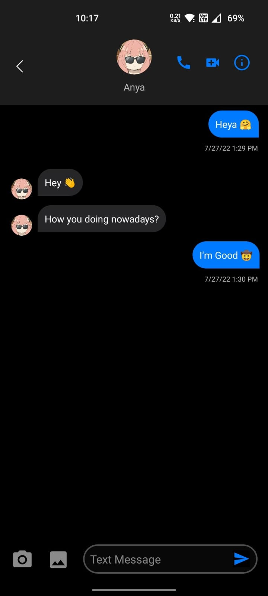
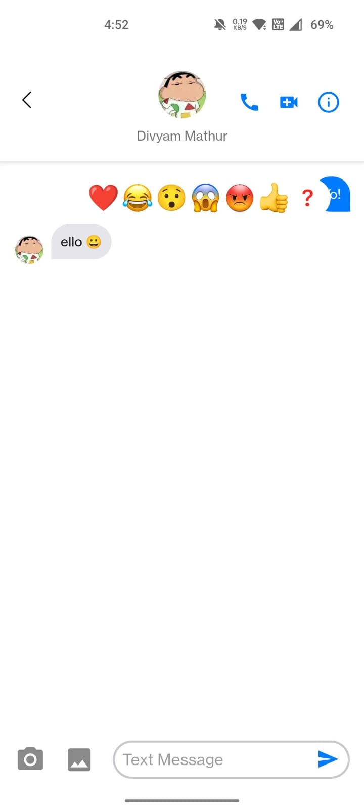

# Fabian Messenger (iMessage Clone)

Fabian Messenger is a feature-rich chat application inspired by **iMessage**, designed to provide a seamless and secure messaging experience. This project focuses on modern communication needs, including encryption, multimedia sharing, and interactive user features.

----------

## 🚀 Features

-   🎭 **Reactions:** Express yourself with emoji reactions to messages.
-   🖼️ **Image and Text Messaging:** Send and receive both text and image messages with ease.
-   🔐 **Text Encryption:** Securely encrypt messages before storing in **Firebase**.
-   💬 **Typing Indicator:** Real-time typing status to know when the other person is typing.
-   📞 **Voice and Video Call Shortcut:** Quick access to initiate voice or video calls.
-   📸 **Camera and Gallery Support:** Capture pictures directly or select from the gallery.
-   🌙 **Dark Mode:** Eye-friendly dark mode for comfortable messaging.
-   📇 **Contact Information Popup:** View detailed contact information like **iMessage**.
-   🗜️ **Image Compression Option:** Choose between compressed image sharing or sending in HD.

----------

## 📸 Screenshots

| Dark Mode | Reaction Popup |
|-----------|----------------|
|  |  |

----------

## Future Enhancements

-   Group chat support.
-   Message read receipts.
-   Improved media handling.

